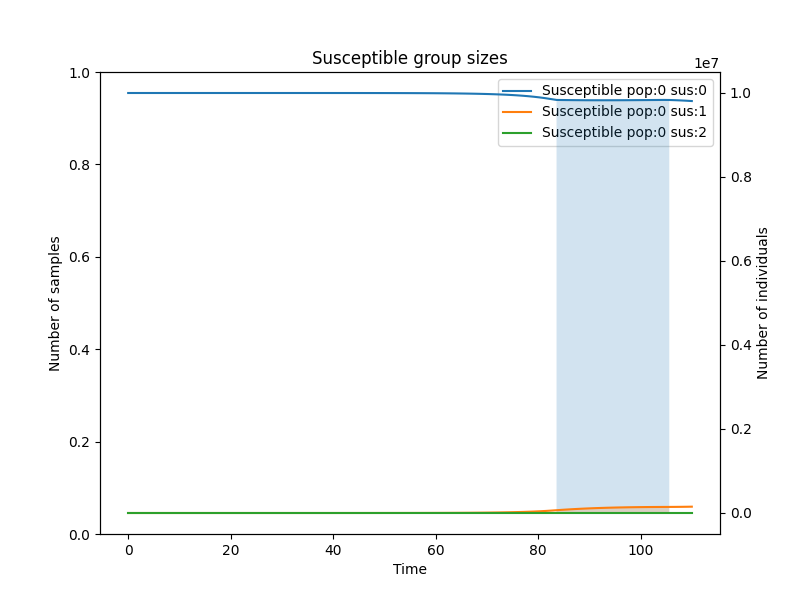

Basic tutorial
==============

In this tutorial we will create a simulation scenario: we will choose parameters and set the model using the Python API.

Initialisation
--------------

We begin with choosing the number of mutable sites, where single nucleotide substitution can occur. We will have 2 such sites. Hence, 16 different haplotypes might appear in the simulation as a result of mutations.

Next, we need to decide how many populations (demes) there are in the simulation. Let’s create three populations.

We will also create 3 types of susceptibility. Initially, all the individuals start with the absence of any specific immunity types.

The user can also specify a random seed.

.. code-block:: python

	import VGsim
	number_of_sites = 2
	populations_number = 3
	number_of_susceptible_groups = 3
	simulator = VGsim.Simulator(number_of_sites, populations_number, number_of_susceptible_groups, seed=1234)

Transmission, recovery and sampling rates
-----------------------------------------

Assume that a patient becomes uninfectious within 10 days on average. Remember, that sampling an individual also means that this person becomes uninfectious. So, the sum of recovery and sampling rates is 1/10=0.1.

If 1 in 100 cases are sampled, then the recovery rate to sampling rate ratio is 99:1. Hence, recovery rate is 0.099 and sampling rate is 0.001.

Now, if in the absence of immune individuals in the population (e.g., in the beginning of the pandemic) an infectious person transmits the disease to 2.5 individuals on average, the birth rate is 2.5/10=0.25 (because if there are 2.5 transmissions in 10 days, hence there are 0.25 transmission in a single day).

.. code-block:: python

	simulator.set_transmission_rate(0.25)
	simulator.set_recovery_rate(0.099)
	simulator.set_sampling_rate(0.001)

Now let us assume that the original virus has haplotype AA. And the haplotype GG is two times more contagious. So, the transmission rate for that haplotype is 0.5.

.. code-block:: python

	simulator.set_transmission_rate(0.5, haplotype="GG")

Mutation rates and substitution probabilities
---------------------------------------------

The GG haplotype can appear in the population only through mutations an both sites. For example, for SARS-CoV-2, there is roughly on average one new mutation per three transmissions (average time between transmissions are 1/0.25=4 days in our model) per approximately 30000bp genome. So, the per-site mutation rate is 1/(3*4*30000)≈0.000003. For demonstration purposes though, we set mutation rate to value of 0.0003 in this example to demonstrate functionality  on a relatively small simulation (otherwise mutations do not appear due to rarity of such an event). We also set the substitution probabilities. In fact, it might be more convenient sometimes to use unnormalised weights instead. Here we assume that the A->G substitution is twice more likely than A->T or A->C (the A->A substitution is not allowed, so the first entry of the array will be dropped for the corresponding haplotypes). Let’s also assume that having allele G at the first site increases the mutation rate at the second site by three times.

.. code-block:: python

	mutation_rate=0.0003
	substitution_weights=[1,1,1,2]#ATCG
	simulator.set_mutation_rate(mutation_rate, substitution_weights)
	simulator.set_mutation_rate(3*mutation_rate, haplotype="G*", mutation=1)

Susceptibility types
--------------------

At the beginning of the epidemics all the individuals do not have any special immunity, and thus we assign them by default susceptibility type 0. Now let us assume that after recovery individuals get some immunity. If an individual was infected with haplotype carrying G at the first site (we will denote them by G*), the susceptibility type after recovery will be 2. For all other haplotypes it will be 1.

.. code-block:: python
	
	simulator.set_susceptibility_type(1)
	simulator.set_susceptibility_type(2, haplotype="G*")

Now for each susceptibility type we will specify how it changes the risk of infection. We will assume that susceptibility type 1 gives strong (but not perfect) protection against all haplotypes except G* by reducing the risk of a new infection by ten times. And it gives only some protection against haplotypes G*. The immunity is lost on average after 90 days, and the individual is hence moved to the susceptibility type 0.

.. code-block:: python

	simulator.set_susceptibility(0.1, susceptibility_type=1)
	simulator.set_susceptibility(0.5, susceptibility_type=1, haplotype="G*")
	simulator.set_immunity_transition(1/90, source=1, target=0)

Susceptibility type 2 will be a result of recovery from haplotype G* or vaccination. It gives complete protection from all the haplotypes, and it is lost after 180 days on average. At the beginning of the epidemics there is no vaccine, we will add it a bit later.

.. code-block:: python
	
	simulator.set_susceptibility(0.0, susceptibility_type=2)
	simulator.set_immunity_transition(1/180, source=2, target=0)

Population model
----------------

First, we should define the population sizes. Let's create populations with sizes 10000000, 5000000 and 1000000 respectively.

.. code-block:: python

	simulator.set_population_size(10000000, population=0)
	simulator.set_population_size(5000000, population=1)
	simulator.set_population_size(1000000, population=2)

Now let us add some more heterogeneity. First of all assume that population 1 has a three times higher sampling rate than population 0, while population 2 does not sequence at all.

.. code-block:: python
	
	simulator.set_sampling_multiplier(3, population=1)
	simulator.set_sampling_multiplier(0, population=2)

Now, all the countries impose lockdowns when 20% of its population is infected simultaneously. The lockdowns are lifted if this number drops to 2%. The amount of contacts is ten times less during the lockdown.

.. code-block:: python
	
	simulator.set_npi([0.1, 0.2, 0.02])

Migration
---------

There are 3 populations in our scenario. Assume that an average individual from one population spends on average 10 days per year outside of its population of origin. The chance to travel to any destination is the same. The cumulative migration probability is 10/365. The probability to travel to a particular destination is 10 (days)/365 (days)/2 (the number of possible destinations). So, we can set

.. code-block:: python
	
	simulator.set_migration_probability(10/365/2)

Running the simulation
----------------------

Let us simulate the first 110 days. The first argument is the maximal number of iterations to be performed. Notice that the simulation will stop if this number is achieved even if 110 days (of virtual epidemics) did not pass.

.. code-block:: python
	
	simulator.simulate(10000000, epidemic_time=110)

Example of output

.. image:: output.png

After these 90 days, the vaccine was developed, and the susceptible individuals of types 0 and 1 can move to type 2 with the rate 0.05 (average waiting time of 20 days to get vaccinated).

.. code-block:: python
	
	simulator.set_immunity_transition(0.05, source=0, target=1)
	simulator.set_immunity_transition(0.05, source=0, target=2)

Also, the rising awareness in the population reduces the contact density (e.g. because of masks) in populations 0 and 1.

.. code-block:: python
	
	simulator.set_contact_density(0.7, population=0)
	simulator.set_contact_density(0.7, population=1)

And the amount of travels is reduced with population 2

.. code-block:: python
	
	simulator.set_migration_probability(2/365/2, source=0, target=2)
	simulator.set_migration_probability(2/365/2, source=1, target=2)

#TODO

.. code-block:: python

	simulator.simulate(1000, method='tau')

Visualizing epidemiological trajectories
----------------------------------------

Now let us plot how the haplotypes appear and spread in each population.

.. code-block:: python

	simulator.add_plot_infectious(population=0, haplotype='AA', step_num=100)
	simulator.add_plot_infectious(population=1, haplotype='AA', step_num=100)
	simulator.add_plot_infectious(population=2, haplotype='AA', step_num=100)
	simulator.add_title(name="AA haplotype")
	simulator.add_legend()
	simulator.plot()

.. image:: AA_haplotype.png

And finally let us look how the susceptible group sizes change.

.. code-block:: python

	simulator.add_plot_susceptible(population=0, susceptibility_type=0, step_num=100)
	simulator.add_plot_susceptible(population=0, susceptibility_type=1, step_num=100)
	simulator.add_plot_susceptible(population=0, susceptibility_type=2, step_num=100)
	simulator.add_title(name="Susceptible group sizes")
	simulator.add_legend()
	simulator.plot()

Extracting the genealogy
------------------------

Finally, we extract the genealogy of the sampled cases. We write the genealogy and mutations on it into a file in MAT format. These files can be used as phastSim input to add neutral mutations.

.. code-block:: python

	simulator.genealogy()
	file_name = "example"
	simulator.output_newick(file_name)
	simulator.output_mutations(file_name)

The user can also output the migrations of the genealogy lineages to have the detailed information about population structure.

.. code-block:: python
	
	simulator.output_migrations(file_name)

Print all the parameters
------------------------
One can check the parametrization of the model by printing all the parameters. The basic parameters (transmission, recovery, sampling, mutation rates, substitution weights, susceptibility type after recovery)

.. code-block:: python
	
	simulator.print_basic_parameters()

Susceptibility matrix (how each immunity type affects susceptibility to each of the haplotypes) and the susceptibility type transition matrix

.. code-block:: python
	
	simulator.print_immunity_model()

Finally, let’s print population information (size, contact density, sampling modifier, lockdown settings) and migration matrix

.. code-block:: python
	
	simulator.print_populations()

Resulting code
--------------

This code can be found `here <https://github.com/Genomics-HSE/VGsim/blob/main/testing/example.ipynb>`_.

.. code-block:: python

	import VGsim
	number_of_sites = 2
	populations_number = 3
	number_of_susceptible_groups = 3
	simulator = VGsim.Simulator(number_of_sites, populations_number, number_of_susceptible_groups, seed=1234)

	simulator.set_transmission_rate(0.25)
	simulator.set_recovery_rate(0.099)
	simulator.set_sampling_rate(0.001)
	simulator.set_transmission_rate(0.5, haplotype="GG")
	mutation_rate=0.000003
	substitution_weights=[1,1,1,2]#ATCG
	simulator.set_mutation_rate(mutation_rate, substitution_weights)
	simulator.set_mutation_rate(3*mutation_rate, haplotype='G*', mutation=1)

	simulator.set_susceptibility_type(1)
	simulator.set_susceptibility_type(2, haplotype='G*')
	simulator.set_susceptibility(0.1, susceptibility_type=1)
	simulator.set_susceptibility(0.5, susceptibility_type=1, haplotype='G*')
	simulator.set_immunity_transition(1/90, source=1, target=0)
	simulator.set_susceptibility(0.0, susceptibility_type=2)
	simulator.set_immunity_transition(1/180, source=2, target=0)

	simulator.set_population_size(10000000, population=0)
	simulator.set_population_size(5000000, population=1)
	simulator.set_population_size(1000000, population=2)
	simulator.set_sampling_multiplier(3, population=1)
	simulator.set_sampling_multiplier(0, population=2)
	simulator.set_npi([0.1, 0.01, 0.002])
	simulator.set_migration_probability(10/365/2)

	simulator.simulate(10000000, epidemic_time=110)

	simulator.set_immunity_transition(0.05, source=0, target=1)
	simulator.set_immunity_transition(0.05, source=0, target=2)
	simulator.set_contact_density(0.7, population=0)
	simulator.set_contact_density(0.7, population=1)
	simulator.set_migration_probability(2/365/2, source=0, target=2)
	simulator.set_migration_probability(2/365/2, source=1, target=2)

	simulator.simulate(1000, method='tau')

	simulator.add_plot_infectious(population=0, haplotype='AA', step_num=100)
	simulator.add_plot_infectious(population=1, haplotype='AA', step_num=100)
	simulator.add_plot_infectious(population=2, haplotype='AA', step_num=100)
	simulator.add_title(name="AA haplotype")
	simulator.add_legend()
	simulator.plot()

	simulator.add_plot_susceptible(population=0, susceptibility_type=0, step_num=100)
	simulator.add_plot_susceptible(population=0, susceptibility_type=1, step_num=100)
	simulator.add_plot_susceptible(population=0, susceptibility_type=2, step_num=100)
	simulator.add_title(name="Susceptible group sizes")
	simulator.add_legend()
	simulator.plot()

	simulator.genealogy()
	file_name = "example"
	simulator.output_newick(file_name)
	simulator.output_mutations(file_name)
	simulator.output_migrations(file_name)

	simulator.print_basic_parameters()
	simulator.print_immunity_model()
	simulator.print_populations()
